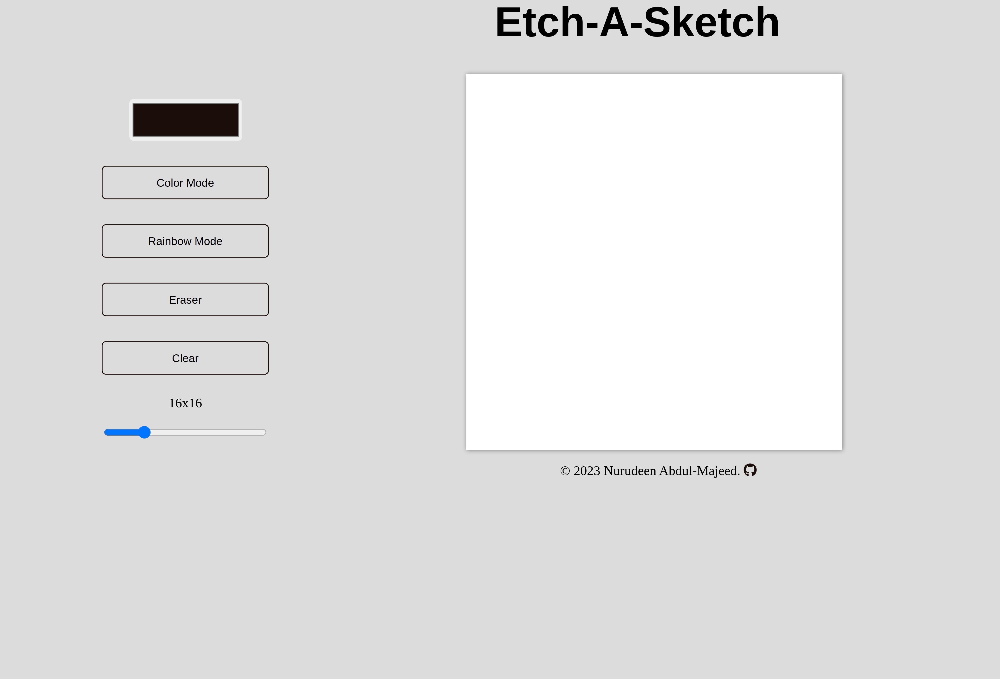

# Etch-A-Sketch

This is a solution to the [Etch A Sketch project in The Odin Project curriculum](https://www.theodinproject.com/lessons/foundations-etch-a-sketch).

## Table of contents

- [Overview](#overview)
  - [The challenge](#the-challenge)
  - [Screenshot](#screenshot)
  - [Links](#links)
- [My process](#my-process)
  - [Built with](#built-with)
  - [Tools used](#tools-used)
  - [Features](#features)
  - [What I learned](#what-i-learned)
  - [Continued development](#continued-development)
  - [Useful resources](#useful-resources)
- [Author](#author)
- [Acknowledgments](#acknowledgments)

## Overview

### The challenge

The user:

- Should be able to create a dynamic grid of square divs on a webpage.
- Can customize the size of the grid by entering the desired number of squares per side.
- Can interact with the grid by hovering the mouse over the squares.
- Should benefit from user input validation that limits the number of squares per side to prevent performance issues.
- Should optionally, experience extra features such as randomizing RGB values.

### Screenshot

### Links

- Source code URL: https://github.com/nuru484/A-Calculator
- Live Site URL: https://nuru484.github.io/A-Calculator/

## My process

### Built with

- 
- 
- 

### Tools Used

- 
- 
- 

### Features

- Dynamic and responsive grid creation.
- User-friendly input for grid size.
- Seamless grid generation without page reload.
- Efficient resource management for larger grid sizes.

### What I learned

- Learnt dynamic and responsive grid creation.
- Applied CSS flexbox for grid layout.
- Learnt how to manipulate CSS properties with JavaScript to change element appearance.
- Learnt how to validate and limit user input to prevent performance issues.

### Continued development

- To add a save button.
- Make it responsive on all devices
- Add an option to for user to be able to change the grid container background color.
- And any other feature worth adding

### Useful resources

- [Interneting Is Hard](https://internetingishard.netlify.app/html-and-css/flexbox/index.html) - This website helped me in getting clear understanding of Flexbox and how to work with it.
- [OpenAI](https://chat.openai.com/?model=text-davinci-002-render-sha) - I use ChatGPT to get simple explanations of complex syntax and the ones I just met.

## Author

- Twitter - [@ABDULMAJEEDNUR3](https://twitter.com/ABDULMAJEEDNUR3)
- GitHub - [@Nuru484](https://github.com/nuru484)

## Acknowledgments

- Inspiration by [The Odin Project](https://www.theodinproject.com/)

Big thanks to myself for not giving up on this journey, I shall get there someday, Insha Allah.
